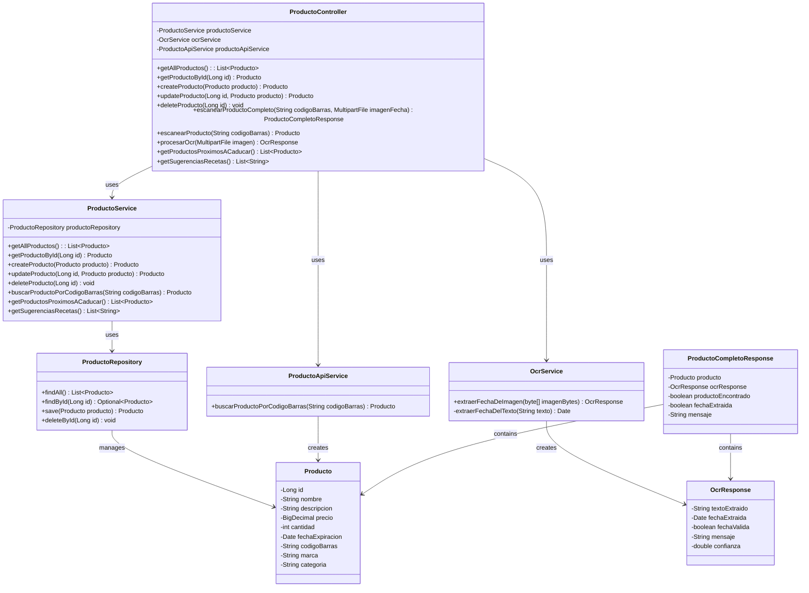
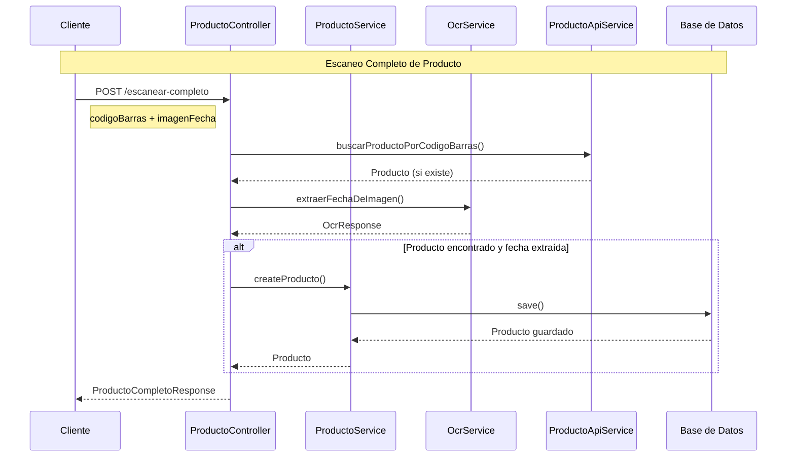
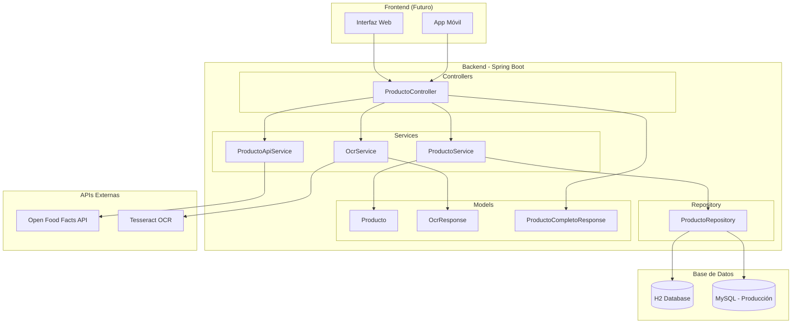

# 🏗️ Arquitectura del Sistema - Despensa Inteligente

## 📊 Diagrama de Clases



## 🔄 Flujo de Datos



## 🏗️ Arquitectura del Sistema



## 📱 Endpoints y Funcionalidades

```mermaid
graph LR
    subgraph "CRUD Básico"
        GET1[GET /productos]
        GET2[GET /productos/{id}]
        POST1[POST /productos]
        PUT1[PUT /productos/{id}]
        DELETE1[DELETE /productos/{id}]
    end

    subgraph "Funcionalidades Avanzadas"
        SCAN[POST /escanear-completo]
        BARCODE[POST /escanear]
        OCR[POST /ocr]
        ALERTS[GET /alertas]
        RECIPES[GET /recetas]
    end

    subgraph "Servicios"
        PS[ProductoService]
        OS[OcrService]
        PAS[ProductoApiService]
    end

    GET1 --> PS
    GET2 --> PS
    POST1 --> PS
    PUT1 --> PS
    DELETE1 --> PS

    SCAN --> PS
    SCAN --> OS
    SCAN --> PAS
    BARCODE --> PAS
    OCR --> OS
    ALERTS --> PS
    RECIPES --> PS
```

## 🎯 Patrones de Diseño Utilizados

### **1. MVC (Model-View-Controller)**
- **Model**: Entidades (`Producto`, `OcrResponse`, `ProductoCompletoResponse`)
- **View**: Respuestas JSON de la API
- **Controller**: `ProductoController` maneja las peticiones HTTP

### **2. Repository Pattern**
- `ProductoRepository` abstrae el acceso a datos
- Facilita el cambio de base de datos
- Centraliza las operaciones CRUD

### **3. Service Layer Pattern**
- `ProductoService` contiene la lógica de negocio
- `OcrService` maneja el procesamiento OCR
- `ProductoApiService` gestiona integraciones externas

### **4. DTO Pattern**
- `OcrResponse` para respuestas del OCR
- `ProductoCompletoResponse` para respuestas complejas
- Separación entre entidades y DTOs

## 🔧 Componentes del Sistema

### **Controllers**
- **ProductoController**: Maneja todas las peticiones HTTP
- Endpoints REST para CRUD y funcionalidades avanzadas
- Validación de entrada y manejo de errores

### **Services**
- **ProductoService**: Lógica de negocio para productos
- **OcrService**: Procesamiento de imágenes con Tesseract
- **ProductoApiService**: Integración con Open Food Facts

### **Repository**
- **ProductoRepository**: Acceso a datos con Spring Data JPA
- Operaciones CRUD automáticas
- Consultas personalizadas si es necesario

### **Models**
- **Producto**: Entidad principal del sistema
- **OcrResponse**: Respuesta del procesamiento OCR
- **ProductoCompletoResponse**: Respuesta combinada

## 🌐 Integraciones Externas

### **Open Food Facts API**
- **Propósito**: Obtener información de productos por código de barras
- **Gratuito**: Sin límites de uso
- **Datos**: Nombre, descripción, marca, categoría, precio

### **Tesseract OCR**
- **Propósito**: Extraer fechas de caducidad de imágenes
- **Gratuito**: Open source
- **Idiomas**: Español e inglés
- **Precisión**: Configurable según necesidades

### **H2 Database**
- **Desarrollo**: Base de datos en memoria
- **Producción**: MySQL o PostgreSQL
- **Ventajas**: Fácil configuración, sin instalación

## 📊 Flujo de Datos Típico

### **1. Creación Manual de Producto**
```
Cliente → ProductoController → ProductoService → ProductoRepository → H2 Database
```

### **2. Escaneo de Código de Barras**
```
Cliente → ProductoController → ProductoApiService → Open Food Facts API → Producto
```

### **3. Procesamiento OCR**
```
Cliente → ProductoController → OcrService → Tesseract → OcrResponse
```

### **4. Escaneo Completo**
```
Cliente → ProductoController → [ProductoApiService + OcrService] → ProductoCompletoResponse
```

## 🚀 Escalabilidad

### **Horizontal**
- Múltiples instancias de la aplicación
- Load balancer para distribución de carga
- Base de datos replicada

### **Vertical**
- Aumentar recursos del servidor
- Optimizar consultas de base de datos
- Cache de respuestas frecuentes

### **Futuras Mejoras**
- **Cache**: Redis para respuestas frecuentes
- **Queue**: RabbitMQ para procesamiento asíncrono
- **Monitoring**: Prometheus + Grafana
- **Logs**: ELK Stack (Elasticsearch, Logstash, Kibana)

## 🔒 Seguridad

### **Implementado**
- Validación de entrada en controladores
- Manejo de errores sin exposición de detalles
- Configuración de CORS si es necesario

### **Futuras Mejoras**
- **Autenticación**: JWT tokens
- **Autorización**: Roles y permisos
- **HTTPS**: Certificados SSL
- **Rate Limiting**: Límites de peticiones

---

**¡Arquitectura bien estructurada y escalable!** 🏗️
